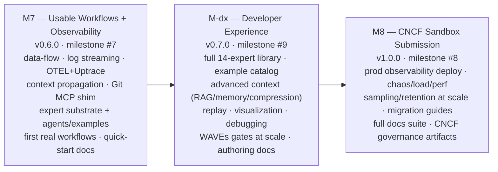
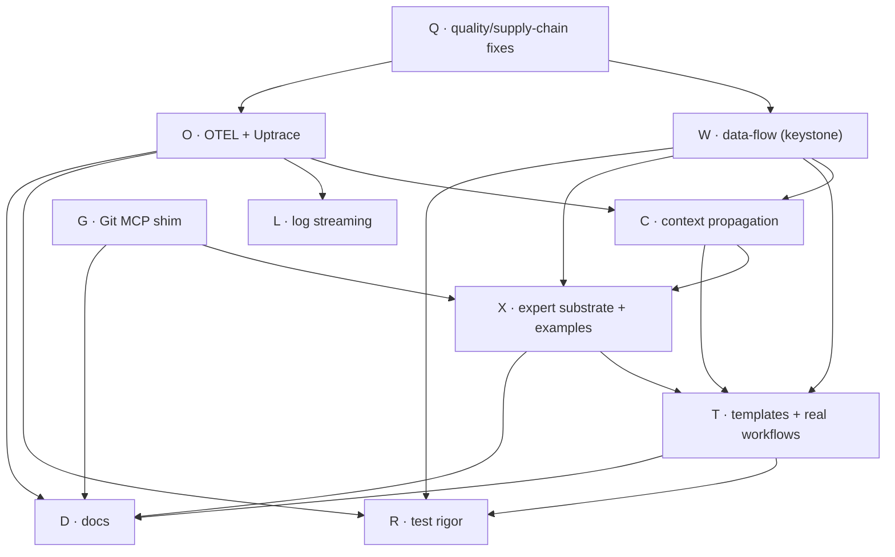

<!-- SPDX-License-Identifier: Apache-2.0 -->

# Zynax M7 — Usable Workflows + Observability Planning

> **Target version:** v0.6.0 · **GitHub milestone:** #7 (`Full Observability (M7)`)
> **Status:** Active (opened 2026-06-15) · **Planning author:** SPDD program plan
> **Program context:** first of a three-milestone program M7 → M-dx → M8 (see [§1 Program Roadmap](#1--program-roadmap)).

This document is the **single planning source of truth** for M7. It is generated from
the milestone brief and reconciled against **live GitHub + live stack state** (the local
stack was started and exercised on 2026-06-15; findings are recorded in
[§4 Reality Check](#4--reality-check-what-zynax-can-and-cannot-do-today)). Every EPIC maps
to SPDD canvases and GitHub issues; every implementation issue traces back to a specification.

The brief asked for 22 deliverables and an acceptance matrix; the map from brief →
section is in [Appendix A](#appendix-a--brief-deliverable-coverage-map).

---

## 0 — TL;DR

M6 shipped a production-ready **platform** (K8s, mTLS, Postgres, EventBus, Helm, SDK on
PyPI). But a developer cannot yet do **real work** with it: workflows cannot pass data
between states, you cannot stream execution logs, and there is no telemetry. M7 closes
that gap with one **vertical slice** — *author a real workflow, run it locally, watch it
execute end-to-end with traces/metrics/logs* — and lays the substrate for the expert-agent
system and example catalog that M-dx scales out.

**M7 ships when:** a developer runs `docker compose up` (platform **+ Uptrace**), applies a
real multi-step workflow with data flowing state→state, streams its logs, and sees the full
distributed trace (api-gateway → compiler → engine → broker → registry → agent) in Uptrace —
with green `make ci` and the supply-chain/coverage gaps from the reality check closed.

---

## 1 — Program Roadmap

The brief describes ~3 milestones of work. Rather than one unbounded milestone (which fights
the Agentic Delivery Playbook's "thin vertical slices, small mergeable PRs" principle), it is
sequenced as a **program** over the three already-planned GitHub milestones. This plan defines
all three at EPIC altitude and **M7 in full executable detail**.



| Milestone | Version | GH # | Theme | Why it is a discrete slice |
|-----------|---------|------|-------|----------------------------|
| **M7** | v0.6.0 | #7 | **Usable Workflows + Observability** | The minimum to do *one real workflow* with full telemetry. Everything else depends on data-flow + observability existing first. |
| **M-dx** | v0.7.0 | #9 | **Developer Experience** | Scales experts + examples + context once the substrate exists. Pure additive; no platform contract changes. |
| **M8** | v1.0.0 | #8 | **CNCF Sandbox** | Production hardening, scale testing, governance — gated on a feature-complete, observable platform. |

> **Reframing note.** GitHub milestone #7 was titled *"Full Observability"*. M7 keeps observability
> as a pillar but is **broader**: observability is necessary but not sufficient for "usable". The
> GitHub milestone title is unchanged (idempotent reuse); the scope is this document.

---

## 2 — Vision & Problem Statement

**Vision.** Zynax is the **control plane for agentic software delivery**: declarative YAML
workflows dispatch capabilities to pluggable agents, executed durably on pluggable engines,
fully observable. A developer should author a workflow, run it locally in one command, and
watch every step — without writing orchestration code.

**Problem (today, empirically verified 2026-06-15).** The platform runs, but:

1. **Workflows can't pass data.** `output:` bindings are rejected at compile time
   (`"not yet implemented; … upgrade to M7+"`). Every state is isolated — no real pipeline
   is expressible. *This is the keystone blocker.*
2. **No execution visibility.** `GET /api/v1/workflows/{id}/logs` returns
   `{"error":"streaming not supported"}`. There is no OTEL, no Prometheus scrape, no trace.
3. **No reference agents.** `agents/examples/` does not exist; the SDK has no canonical
   "write-your-own-agent" example, and there is no runtime expert pattern.
4. **No authoring ergonomics.** No reusable workflow/task/expert templates; no Git MCP surface
   for agent/expert authoring; quick-start docs are missing.
5. **Quality debt blocks a clean `make ci`.** `security-agents` fails on a tools-image `pip`
   CVE; `test-coverage` fails on an interface-only package; PyPI Trusted Publisher history is
   undocumented.

**Outcome.** Close 1–5 so the [§0 acceptance scenario](#0--tldr) passes.

---

## 3 — SPDD Discipline (how every spec is generated)

Per ADR-019, every `feat:` issue is preceded by a **REASONS Canvas** (status `Aligned`) before
any implementation. This plan front-loads the SPDD artifacts:

- **One canvas per EPIC** is committed with this plan under `docs/spdd/<letter>-<slug>/canvas.md`
  (all 10: [W](../spdd/1167-workflow-data-flow/canvas.md), [L](../spdd/468-log-streaming/canvas.md),
  [O](../spdd/467-observability-otel-uptrace/canvas.md), [C](../spdd/1168-context-propagation/canvas.md),
  [G](../spdd/1169-git-mcp-shim/canvas.md), [X](../spdd/1170-expert-substrate/canvas.md),
  [T](../spdd/1171-templates-real-workflows/canvas.md), [R](../spdd/469-test-rigor/canvas.md),
  [Q](../spdd/1172-quality-supply-chain/canvas.md), [D](../spdd/1173-docs/canvas.md)). Each canvas's
  **O — Operations** section lists the EPIC's stories in `spdd-story` form (As-a / I-want / so-that,
  size, acceptance criteria, out-of-scope, dependencies) — ready to become one GitHub issue each.
  `feat:` canvases (W/L/O/C/G/X/T) are the binding SPDD artifact; R/Q/D canvases are committed for
  traceability even though those types are SPDD-exempt.
- **SPDD command runbook** for every EPIC is in [§9](#9--spdd-command-runbook).
- `fix:`, `refactor:`, `docs:`, `ci:`, `chore:`, `test:` issues are **SPDD-exempt** (no canvas).

Traceability chain enforced for every issue:

```
ROADMAP/brief  →  this plan (EPIC)  →  REASONS Canvas  →  ADR (if one-way door)
               →  GitHub issue (labels/DoD/AC)  →  PR (Canvas-linked)  →  test + telemetry validation
```

---

## 4 — Reality Check (what Zynax can and cannot do today)

Verified by booting the full stack (`make run-local`, 13 containers healthy) and the test
suite on 2026-06-15.

### Works today ✅
| Capability | Evidence |
|------------|----------|
| Full local stack boots | 13 containers healthy after compose-corruption fix (PR #1166) |
| Apply a (single-state) workflow | `POST /api/v1/apply` `e2e-demo.yaml` → `run_id`, runs to `WORKFLOW_STATUS_COMPLETED` |
| Query workflow status | `GET /api/v1/workflows/{id}` → status JSON |
| Spec validation | `make validate-spec` — all 5 validators pass |
| Contract + unit + SDK tests | `make test-bdd`, `test-unit-go`, `test-unit-agents` (100% SDK cov) green |
| Proto/Python lint, Go vuln scan | `make lint-protos`, `lint-agents`, `security-go` clean |

### Cannot do yet — **M7 scope** ❌
| Gap | Evidence | Owning EPIC |
|-----|----------|-------------|
| Workflow **state→state data flow** (`output:`) | `apply research-task.yaml` → `COMPILATION_ERROR … "output: which is not yet implemented; … upgrade to M7+"` | **EPIC W** |
| Execution **log/event streaming** (`/logs`) | `GET …/logs` → `{"error":"streaming not supported","code":"INTERNAL"}` | **EPIC L** |
| **OTEL traces / Prometheus metrics** | no telemetry emitted; no collector in compose | **EPIC O** |
| `agents/examples/` reference agents | directory does not exist | **EPIC X** |
| `make lint-go` / `make security-agents` clean run | tools image ships `pip 26.1.1` (PYSEC-2026-196; fix 26.1.2) | **EPIC Q** |
| `make test-coverage` clean run | `services/event-bus/internal/domain` is interface-only → gate reads `0.0% < 90%` | **EPIC Q** |
| PyPI **Trusted Publisher** provenance history | not documented in milestone history / release docs | **EPIC Q** |

These seven rows are **must-fix in M7** and are tracked explicitly in the acceptance matrix
([§13](#13--acceptance-matrix)).

---

## 5 — EPIC Decomposition (M7)

Ten EPICs. Three pre-exist on GitHub (#467/#468/#469) and are **absorbed/extended** rather than
duplicated. New EPICs are created by this plan ([§10](#10--github-bootstrap)).

| EPIC | Title | Type | GitHub issue | Primary area |
|------|-------|------|--------------|--------------|
| **W** | Workflow data-flow (`output:`/input bindings) | feat | **#1167** (new) | workflow-compiler, engine-adapter, protos |
| **L** | Execution log/event streaming (`/logs`) | feat | extends **#468** | api-gateway, engine-adapter, event-bus |
| **O** | Observability: OTEL + Uptrace + Prometheus | feat | absorbs **#467** | all services + adapters, infra |
| **C** | Context propagation (trace + data + correlation) | feat | **#1168** (new) | protos, all services, engine-adapter |
| **G** | Git MCP shim over git-adapter | feat | **#1169** (new) | agents/adapters, cli |
| **X** | Expert-agent substrate + `agents/examples/` | feat | **#1170** (new) | agents/sdk, agents/examples, agent-registry |
| **T** | Reusable templates + first real workflows | feat | **#1171** (new) | spec, cli, docs |
| **R** | Test rigor: benchmarks, fuzz, integration/e2e gates | test | absorbs **#469** (+#553 #493 #1103) | ci, multiple |
| **Q** | Quality & supply-chain fixes (audit closeout) | chore/ci | **#1172** (new) | ci, infra, docs |
| **D** | Docs: quick-start + authoring + observability | docs | **#1173** (new) | docs |

> EPIC issues created 2026-06-15 (W/C/G/X/T/Q/D = #1167–#1173). Pre-existing #467/#468/#469
> annotated to point at canvases O/L/R. Story issues are created per-EPIC via `/spdd-story`
> ([§9](#9--spdd-command-runbook)).

### EPIC W — Workflow data-flow *(keystone; everything depends on it)*
**Why first:** real workflows and expert pipelines are impossible without state→state data.
The compiler explicitly rejects `output:` today.
- **W.1** ADR: data-flow semantics & scoping model (`adr-proposal`) — see [ADR-029 stub](../adr/ADR-029-workflow-data-flow.md)
- **W.2** Proto: `output`/`input` binding fields on `WorkflowIR` state/action + `.feature` (feat, new gRPC boundary → `/spdd-api-test`)
- **W.3** Compiler: compile `output:` bindings to IR; validate references; lift the "not implemented" rejection
- **W.4** Engine-adapter: interpreter threads outputs into a workflow-scoped data context; inputs resolve from it
- **W.5** End-to-end: make `research-task.yaml` + `code-review.yaml` apply and run green
**DoD:** `apply research-task.yaml` reaches terminal state with `summarize` consuming `search`'s output; BDD scenario for data-flow; ≥90% domain cov.

### EPIC L — Execution log/event streaming
**Why:** the `/logs` endpoint is stubbed; developers can't watch a run. Couples with #468
(replace polling with Temporal history long-poll) on the engine side.
- **L.1** Engine-adapter: history streaming (long-poll `GetWorkflowHistory`) — **closes #468**
- **L.2** Event-bus: per-workflow event subscription stream (reuse `Subscribe` w/ `WorkflowID` scope)
- **L.3** api-gateway: real Server-Sent-Events / chunked `GET /api/v1/workflows/{id}/logs`
- **L.4** CLI: `zynax logs <run-id> --follow`
**DoD:** streaming logs for the e2e-demo run show each state transition + capability event; no `streaming not supported`.

### EPIC O — Observability: OTEL + **Uptrace (traces · metrics · logs · APM, with login UI)** + Prometheus *(absorbs #467)*
**Backend decision:** **Uptrace** as the single default OTEL backend for **traces, metrics, logs,
and APM**, with its **web UI (login) for viewing logs and service maps**; **OTLP/gRPC** default,
OTLP/HTTP optional. No Jaeger/Loki/Elasticsearch (see [ADR-030 stub](../adr/ADR-030-observability-uptrace.md)).
Uptrace ships in **both** the local `docker compose` stack **and** the Helm deployment, so a
developer always has a UI to see logs/traces — locally and in-cluster.
- **O.1** ADR: OTEL + Uptrace (traces+metrics+logs+APM), OTLP/gRPC default, head-based parent sampling (`adr-proposal`)
- **O.2** Shared `libs/zynaxotel` Go package: tracer/meter/**logger** providers, OTLP exporter, resource attrs (semconv)
- **O.3** Instrument all 7 services: gRPC server/client interceptors + HTTP middleware (api-gateway)
- **O.4** Prometheus `/metrics` already exists (M6 gRPC health/metrics) — add RED metrics + exemplars; forward to Uptrace metrics
- **O.5** Trace propagation across Temporal activities + NATS headers (W3C `traceparent`)
- **O.6** Python adapters: OTEL SDK (traces+logs) in `agents/sdk`; auto-instrument capability handlers
- **O.7** **`docker compose up` Uptrace stack** (`infra/docker-compose/docker-compose.observability.yml`): Uptrace + its ClickHouse/Postgres deps + OTLP collector; **login UI on a 70xx host port** for logs/traces/APM
- **O.8** **Uptrace Helm chart** (`infra/helm/charts/uptrace/`): Deployment/Service/Ingress + login UI, wired as the in-cluster OTLP endpoint; values toggle (`observability.enabled`)
- **O.9** **Log export to Uptrace** (structured logs shipped via OTLP logs) so logs are viewable in the Uptrace UI alongside traces; span/metric naming conventions doc + `trace_id`/`span_id` in every log line
**DoD:** one workflow run produces a connected trace across all hops **and its logs**, viewable
in the **Uptrace login UI** (local compose **and** Helm); RED metrics scraped; APM/service-map populated.

### EPIC C — Context propagation
**Why:** experts and multi-step workflows need deterministic context (both **trace context**
and **workflow data context**) to flow across service, engine, and agent boundaries.
- **C.1** ADR: context model — trace context vs. data context vs. correlation IDs; inheritance & handoff rules ([ADR-031 stub](../adr/ADR-031-context-propagation.md))
- **C.2** Propagate `traceparent` + `x-request-id` + `x-namespace` through every gRPC hop and Temporal memo
- **C.3** Workflow-scoped data context store (builds on EPIC W) with explicit read/write scoping
- **C.4** Documented handoff contract between agents (what context an agent receives/returns)
**DoD:** a request-id set at api-gateway appears in every downstream span and log line for that run; documented in the context guide.

### EPIC G — Git MCP shim over git-adapter
**Decision:** MCP is a **thin protocol shim over the existing git-adapter** (one Git
implementation, two surfaces) — see [ADR-032 stub](../adr/ADR-032-git-mcp-shim.md).
- **G.1** ADR: MCP-shim-over-adapter; least-privilege token injection; **no secrets in prompts**
- **G.2** MCP server exposing git-adapter capabilities (clone/branch/commit/PR/review) as MCP tools
- **G.3** Credential injection via env/secret ref at process start; redaction in logs/traces
- **G.4** CLI/dev wiring: `zynax mcp git` + `.mcp.json` example for Claude Code authoring loop
**DoD:** an authoring session can open a PR via MCP with a scoped token; no token ever serialized into a prompt; security review PASS.

### EPIC X — Expert-agent substrate + `agents/examples/`
**Decision (both substrates, mapped):** runtime **AgentDef** experts (registered, dispatched,
OTEL-traced) for in-workflow execution **and** Claude Code experts (extend
`automation/workflows/experts/*.yaml` + `.claude` skills) for the delivery/authoring loop, with
a documented mapping ([ADR-033 stub](../adr/ADR-033-expert-agent-substrate.md)).
- **X.1** ADR: expert substrate + runtime↔authoring mapping table
- **X.2** Create `agents/examples/` with three reference agents (uses SDK): `echo`, `summarizer`, `go-review-expert`
- **X.3** Runtime expert pattern: `kind: AgentDef` expert template + registration + capability schema
- **X.4** Wire `make lint-agent`/`test-unit-agent` to discover `agents/examples/*`
- **X.5** Map each authoring expert (`experts/*.yaml`) to its runtime counterpart (or "authoring-only")
**DoD:** `agents/examples/` builds, lints, tests; `go-review-expert` registers and is dispatchable in a workflow with a trace.

### EPIC T — Reusable templates + first real workflows
- **T.1** Template mechanism: workflow templates + task templates + expert templates (with versioning field)
- **T.2** Workflow validation + versioning fields surfaced in CLI (`zynax validate`, `version:`)
- **T.3** First **production-quality** real workflows (runnable end-to-end): `code-review`, `ci-pipeline`, `feature-implementation`
- **T.4** `zynax init workflow|expert` scaffolds from templates
**DoD:** the three real workflows apply and run green locally with data-flow + traces; templates documented.

### EPIC R — Test rigor *(absorbs #469; pulls in #553, #493, #1103)*
- **R.1** Benchmarks for IRInterpreter + workflow-compiler with regression gate — **#493**
- **R.2** Fuzz tests for the YAML→IR compiler
- **R.3** Activate integration test suite as a required CI gate — **#553**
- **R.4** Flip platform-readiness `xfail` to real `zynax apply` e2e — **#1103**
- **R.5** Observability validation test: assert a run emits a connected trace
**DoD:** benchmarks + fuzz + integration + e2e + observability tests run in CI as gates.

### EPIC Q — Quality & supply-chain fixes (audit closeout)
*(Directly closes the [§4](#4--reality-check-what-zynax-can-and-cannot-do-today) red rows that aren't features.)*
- **Q.1** Bump tools image `pip` → 26.1.2 (PYSEC-2026-196) so `make security-agents` / `lint-go` run clean — `ci`
- **Q.2** Coverage gate: exclude/ærhandle interface-only packages (`event-bus/internal/domain`) so `make test-coverage` passes honestly — `ci`
- **Q.3** Document **PyPI Trusted Publisher** provenance in milestone history + release docs (the SDK publishes via Trusted Publisher; record the OIDC publisher config + first-publish provenance) — `docs`
- **Q.4** Verify & document Go module consumption path (pkg.go.dev) — **#582**
- **Q.5** ADR for `ManifestWorkflowID` 64-bit collision domain — **#583**
**DoD:** `make ci` is green end-to-end on a clean checkout; PyPI Trusted Publisher history present in this doc ([§14](#14--pypi-trusted-publisher-history)).

### EPIC D — Docs: quick-start + authoring + observability
- **D.1** Quick Start (`docker compose up` → apply → watch trace) + Developer Guide
- **D.2** Workflow Authoring + Expert Authoring guides
- **D.3** Context System + Git MCP guides
- **D.4** Observability + OpenTelemetry + Uptrace guides (sampling/retention/troubleshooting)
- **D.5** Examples index + Best Practices + FAQ + Migration notes (v0.5→v0.6)
**DoD:** a new developer can go from clone to a traced real-workflow run using only the docs.

---

## 6 — Dependency Graph & Critical Path



- **Critical path:** `Q → W → C → X → T → D` (data-flow and context gate the expert/example/doc work).
- **Parallelizable from the start:** `Q` (all sub-tasks), `O` (after Q.1 unblocks clean CI), `G` (independent of W).
- **Q is the unblocker:** Q.1/Q.2 must merge early so every other EPIC's PR sees a green `make ci`.

---

## 7 — Parallel Execution Plan (waves)

Designed for autonomous/parallel agent execution (≤3 concurrent per `/milestone-orchestrate`).

| Wave | EPICs / tasks (parallel) | Gate to advance |
|------|--------------------------|-----------------|
| **0** | Q.1, Q.2, Q.3 (CI green + provenance) | `make ci` green on clean checkout |
| **1** | W.1–W.5 (data-flow) · O.1–O.4 (OTEL core) · G.1–G.2 (MCP shim) | data-flow e2e green; trace visible in Uptrace |
| **2** | C.1–C.4 (context) · O.5–O.8 (propagation+Uptrace compose) · L.1–L.4 (log streaming) | request-id end-to-end; `/logs` streams |
| **3** | X.1–X.5 (experts + examples) · T.1–T.4 (templates + real workflows) · G.3–G.4 | 3 real workflows run; reference agents dispatchable |
| **4** | R.1–R.5 (test rigor) · D.1–D.5 (docs) · Q.4/Q.5 | all CI gates active; docs complete; acceptance matrix green |

Each task = one small, independently mergeable PR (≤400 lines target; planning/docs/spec
exempt per CLAUDE.md PR-size rules).

---

## 8 — Risk Register

| # | Risk | Likelihood | Impact | Mitigation | Owner EPIC |
|---|------|-----------|--------|------------|------------|
| 1 | Data-flow scoping (W) becomes a sprawling expression language | Med | High | ADR-029 fixes a **minimal** binding model (no expressions in M7 — literal/path refs only); defer transforms to M-dx | W |
| 2 | OTEL adds latency/overhead in the hot path | Med | Med | Head-based parent sampling default; benchmark in R.5; document overhead | O/R |
| 3 | Uptrace single-binary not prod-grade at scale | Low | Med | M7 targets local/dev; prod deploy + retention is M8 | O |
| 4 | Git MCP token leakage into prompts/traces | Low | **Critical** | ADR-032 mandates injection-at-process-start + log/trace redaction; security review gate (Tier 2) | G |
| 5 | Expert dual-substrate causes drift between runtime & authoring experts | Med | Med | ADR-033 mapping table is the SoT; CI check that every authoring expert declares its mapping | X |
| 6 | Coverage-gate change (Q.2) masks real gaps | Low | Med | Exclude only packages with **zero executable statements**; assert via `go tool cover` count, not a blanket skip | Q |
| 7 | Trace context lost across Temporal/NATS boundaries | Med | High | C.2 propagates via Temporal memo + NATS headers; R.5 asserts a connected trace | C |
| 8 | Scope creep — brief is ~3 milestones | **High** | High | Program split (M7/M-dx/M8); M-dx absorbs full expert library + example catalog + RAG | program |

---

## 9 — SPDD Command Runbook

Run from repo root. `feat:` EPICs require the full pipeline; non-feat are exempt.

```bash
# ── EPIC W — data-flow (feat, new gRPC boundary) ──────────────────────────
/spdd-analysis <W.2-issue>
/spdd-story <W-epic-issue>
/spdd-reasons-canvas <W.2-issue>          # → docs/spdd/<id>-workflow-data-flow/canvas.md
/spdd-security-review docs/spdd/<id>-workflow-data-flow/canvas.md   # must PASS
/spdd-api-test docs/spdd/<id>-workflow-data-flow/canvas.md          # new gRPC boundary → .feature first
# [human sets status: Aligned]
/spdd-generate docs/spdd/<id>-workflow-data-flow/canvas.md          # one O-step; stop; review; repeat W.3→W.5

# ── EPIC O — OTEL+Uptrace (feat) ──────────────────────────────────────────
/spdd-analysis <O-issue>; /spdd-reasons-canvas <O-issue>; /spdd-security-review <canvas>; /spdd-generate <canvas>   # per O-step

# ── EPIC C / G / X / T — same feat pipeline, one canvas per EPIC ──────────
#   /spdd-analysis → /spdd-reasons-canvas → /spdd-security-review → [Aligned] → /spdd-generate (per O-step)
#   EPIC X/T also need /spdd-api-test where a new capability schema or gRPC field is introduced.

# ── EPIC L — log streaming (feat, extends existing endpoint) ──────────────
/spdd-analysis <L-issue>; /spdd-reasons-canvas <L-issue>; /spdd-security-review <canvas>; /spdd-generate <canvas>

# ── SPDD-EXEMPT EPICs (no canvas) ─────────────────────────────────────────
#   EPIC Q: chore/ci/docs   — Q.1 ci, Q.2 ci, Q.3 docs, Q.4 docs, Q.5 adr-proposal
#   EPIC R: test            — benchmarks/fuzz/integration/e2e/observability-validation
#   EPIC D: docs            — all guides
#   #468 (engine history streaming) is refactor:; reuse its existing context, no new canvas.
```

Whole-milestone orchestration: `/milestone-plan` → `/milestone-orchestrate` (≤3 issues/batch,
routed to domain experts) → `/milestone-learn` after each cluster.

---

## 10 — GitHub Bootstrap

Milestone #7 already exists (idempotent reuse). Commands to create the **new** EPIC issues are
in [§10a](#10a--epic-create-commands). Pre-existing EPICs #467/#468/#469 and stories
#493/#553/#582/#583/#1103 are **absorbed** (re-labeled/linked, not recreated).

### 10a — EPIC create commands

> Executed by this plan via `gh` (see PR). One representative shown; the rest follow the same shape.

```bash
gh issue create \
  --title "epic(workflow-compiler): M7.W — Workflow data-flow (output/input bindings)" \
  --label "type: epic,area: workflow-compiler,area: engine-adapter,area: protos,priority: high,milestone: M7" \
  --milestone "Full Observability (M7)" \
  --body "<scope · stories W.1–W.5 · ADR-029 · DoD · AC>  Assisted-by: Claude/claude-opus-4-8"
# … EPICs L, O, C, G, X, T, Q, D analogously (see §5 for scope/stories).
```

---

## 11 — ADRs Required

| ADR | Title | Status | One-way door? | EPIC |
|-----|-------|--------|---------------|------|
| ADR-029 | Workflow data-flow semantics (binding model, scoping) | Proposed | Yes — proto contract | W |
| ADR-030 | Observability: OTEL + Uptrace, OTLP/gRPC, head sampling | Proposed | Yes — backend choice | O |
| ADR-031 | Context propagation model (trace vs data vs correlation) | Proposed | Yes — cross-service contract | C |
| ADR-032 | Git MCP as a thin shim over git-adapter | Proposed | Partly — auth model | G |
| ADR-033 | Expert-agent substrate (runtime AgentDef + authoring experts) | Proposed | Yes — agent model | X |
| ADR-034 | `ManifestWorkflowID` 64-bit collision domain (from #583) | Proposed | No | Q |

Stubs for ADR-029–033 are committed with this plan under [docs/adr/](../adr/) (status `Proposed`;
finalized during each EPIC's canvas alignment).

---

## 12 — Observability, Security & Testing Plans

### Observability plan (default DX = `Zynax → OpenTelemetry → Uptrace`)
- Instrumentation standard: OpenTelemetry; backend: **Uptrace** (single backend for **traces,
  metrics, logs, and APM**, with a **login web UI** + service map); transport: OTLP/gRPC (HTTP optional).
- Signals: distributed traces, RED metrics (+exemplars), **structured logs shipped via OTLP** and
  correlated by `trace_id`/`span_id` — all viewable together in the Uptrace UI.
- Span naming: `<service>.<rpc>` for gRPC, `workflow.<state>` / `capability.<name>` for execution.
- Sampling: head-based parent sampling (configurable ratio; 100% local dev). Retention: M7 = dev defaults; scale retention → M8.
- **Local:** `docker compose -f …observability.yml up` brings Uptrace (+ deps + OTLP collector) with the login UI on a 70xx port.
- **In-cluster:** `infra/helm/charts/uptrace/` deploys Uptrace + UI behind an Ingress, toggled by `observability.enabled`, so logs/traces are visible in any environment — not just locally.
- Validation: R.5 asserts a connected end-to-end trace per run.

### Security plan (review BEFORE implementation — Tier 2 scan per canvas)
Every `feat:` canvas runs `/spdd-security-review`. Focus areas this milestone:
- **STRIDE** on the data-flow context (W/C): tampering/info-disclosure via cross-state data leakage → explicit read/write scoping.
- **Git MCP (G):** credential management (no secrets in prompts), least-privilege token, prompt-injection on PR/issue content, context-leakage via traces (redaction).
- **Experts (X):** agent isolation, capability least-privilege, MCP permission scoping.
- **Supply chain (Q):** pip CVE closeout, cosign/SBOM unchanged from M6, PyPI Trusted Publisher provenance recorded.

### Testing plan (ADR-016 tiers + new gates)
| Test type | Where | Gate |
|-----------|-------|------|
| Unit (≥90% domain) | `services/*/internal/domain` | `make test-coverage` (Q.2 fixes interface-only) |
| BDD contract | `protos/tests/` + `services/*/tests` | `make test-bdd` |
| Integration | `//go:build integration` | **R.3 — new required gate (#553)** |
| Benchmarks (regression) | compiler + interpreter | **R.1 (#493)** |
| Fuzz | YAML→IR compiler | **R.2** |
| E2E | `zynax apply` real workflow | **R.4 (#1103)** |
| Observability validation | trace assertion | **R.5** |
| Performance/load/chaos | — | **deferred to M8** |

---

## 13 — Acceptance Matrix

M7 is **DONE** when every row is green. Rows 1–7 are the [§4](#4--reality-check-what-zynax-can-and-cannot-do-today) gaps the user flagged as must-include.

| # | Acceptance criterion | Verifies | EPIC | Done-check |
|---|----------------------|----------|------|------------|
| 1 | `apply research-task.yaml` runs to terminal with state→state data flow | data-flow | W | e2e test green |
| 2 | `GET /workflows/{id}/logs` streams real execution events | log streaming | L | `zynax logs --follow` shows transitions |
| 3 | One run emits a connected trace across all hops in Uptrace + RED metrics | OTEL/Uptrace | O | R.5 trace assertion |
| 4 | `agents/examples/` builds/lints/tests; a reference expert is dispatchable | reference agents | X | `make test-unit-agent` green |
| 5 | `make security-agents` / `make lint-go` run clean (pip 26.1.2) | supply chain | Q | `make ci` green |
| 6 | `make test-coverage` passes honestly (interface-only handled) | coverage gate | Q | `make ci` green |
| 7 | PyPI Trusted Publisher provenance documented ([§14](#14--pypi-trusted-publisher-history)) | provenance | Q | this doc + release notes |
| 8 | request-id propagates to every downstream span+log | context | C | log/trace inspection |
| 9 | Git MCP opens a PR with a scoped token; no secret in any prompt/trace | Git MCP | G | security review PASS |
| 10 | 3 real workflows (code-review, ci-pipeline, feature-impl) run green | templates/examples | T | e2e |
| 11 | Quick-start takes a new dev from clone → traced real-workflow run | docs | D | doc walkthrough |
| 12 | All new CI gates (integration, benchmark, fuzz, e2e, observability) active | test rigor | R | CI config |

**Definition of Done (every issue):** linked Canvas (feat) or rationale (non-feat); labels +
priority + milestone set; AC met; tests written and green; `make ci` green; telemetry emitted
where applicable; docs updated; one logical commit; PR ≤400 lines or justified; DCO signed;
`Assisted-by` trailer; squash-merged.

---

## 14 — PyPI Trusted Publisher History

> Recorded here per the milestone brief — the program had no durable record of the SDK's PyPI
> Trusted Publisher (OIDC) configuration. This is the canonical history; release notes link here.

**Mechanism.** `zynax-sdk` is published to PyPI via **Trusted Publishing (OIDC)** — no long-lived
API token is stored. The GitHub Actions workflow `sdk-publish.yml` requests a short-lived OIDC
token that PyPI exchanges for an upload scope.

**Required PyPI Trusted Publisher entry.** These are the exact values to register under the
`zynax-sdk` project's *Publishing* settings on pypi.org. They are sourced directly from
`.github/workflows/sdk-publish.yml` (the canonical SoT) — do not transcribe by hand.

| Field | Value |
|-------|-------|
| Distribution (PyPI project) | `zynax-sdk` |
| SDK version (`agents/sdk/pyproject.toml`) | `0.1.0` |
| Publisher | GitHub Actions — owner/repo `zynax-io/zynax` |
| Workflow filename | `sdk-publish.yml` (path `.github/workflows/sdk-publish.yml`) |
| GitHub Environment | `pypi` (set on the `publish` job — `environment: pypi`) |
| Trigger | push of a version tag matching `v*.*.*` |
| OIDC claims | `id-token: write` permission; PyPI exchanges the GitHub OIDC token for an upload scope |
| Trust model | OIDC Trusted Publisher (no long-lived API token stored in secrets) |
| TestPyPI dry-run | `tools-publish.yml` (PRs touching `agents/sdk/` — #805, F.1) |
| Supply-chain artifacts per publish | SPDX SBOM (`syft`) + cosign keyless signature bundles, uploaded to the GitHub Release |

**First-publish provenance.** As of this record the SDK has **not yet been published to PyPI** — no
`v*.*.*` tag has triggered `sdk-publish.yml`, so there is no published version, release URL, or
provenance attestation to cite. The first publish is expected at the **v0.6.0** SDK release tag.
When that tag is pushed, update the table below with the observed values:

| First-publish field | Value |
|---------------------|-------|
| First published version | _pending — fill at first `v*.*.*` publish_ |
| Trigger tag | _pending_ |
| GitHub Release URL | _pending_ |
| Provenance attestation reference | _pending — PyPI attaches a publish attestation via the Trusted Publisher flow_ |

**PyPI-side registration is a manual account action and cannot be verified or performed from this
repository.** Whether the Trusted Publisher entry already exists on pypi.org cannot be determined
from the repo. **Before the next SDK publish**, a maintainer with access to the `zynax-sdk` PyPI
project must confirm — or create — a Trusted Publisher entry using the *exact* values in the table
above (owner `zynax-io`, repo `zynax`, workflow `sdk-publish.yml`, environment `pypi`). If the
entry is missing the `v*.*.*` publish job will fail at the OIDC token exchange.

**Action items in Q.3:** (a) maintainer confirms/creates the PyPI Trusted Publisher entry with the
values above before the next publish; (b) at first publish, fill the "First-publish provenance"
table with the observed version + Release URL + attestation reference; (c) link this section from
the v0.6.0 release notes — recorded as a forward pointer in `CHANGELOG.md` under `[Unreleased]`
until v0.6.0 ships, at which point the v0.6.0 entry links here.

---

## Appendix A — Brief deliverable coverage map

| # | Brief deliverable | Section |
|---|-------------------|---------|
| 1 | milestone description | §0, §2 |
| 2 | roadmap | §1 |
| 3 | dependency graph | §6 |
| 4 | GitHub issue hierarchy | §5, §10 |
| 5 | labels | §10 (existing label set) |
| 6 | milestones | §1 |
| 7 | epics | §5 |
| 8 | features | §5 (stories per EPIC) |
| 9 | implementation order | §6, §7 |
| 10 | critical path | §6 |
| 11 | parallel execution plan | §7 |
| 12 | risk register | §8 |
| 13 | ADR list | §11 |
| 14 | documentation plan | §5 EPIC D |
| 15 | testing plan | §12 |
| 16 | observability plan | §12 |
| 17 | security plan | §12 |
| 18 | rollout strategy | §15 |
| 19 | rollback strategy | §15 |
| 20 | acceptance matrix | §13 |
| 21 | DoD per issue | §13 |
| 22 | SPDD commands per spec | §9 |

---

## 15 — Rollout & Rollback

**Rollout.** Incremental, per-EPIC, behind feature gates where a contract changes:
- Data-flow (W): proto fields are **additive** (backward-compatible per `buf breaking`); the
  compiler accepts manifests without `output:` unchanged.
- OTEL (O): off unless `ZYNAX_OTEL_EXPORTER_OTLP_ENDPOINT` is set → zero impact when unset.
- Uptrace (O.7): separate compose file; never required for the core stack.
- Git MCP (G): opt-in process; no change to runtime workflow path.

**Rollback.** Each EPIC is independently revertible:
- Proto additions are additive → revert is a stub-regenerate, no data migration.
- Observability is env-gated → unset the endpoint to disable.
- Quality fixes (Q) are isolated CI/tooling changes.
- No schema migrations introduced in M7 beyond additive proto fields → no destructive rollback path.

**Version cut.** v0.6.0 tagged via `/milestone-close` after the acceptance matrix is green;
GitHub Release + signed tag; `state/milestone.yaml` rotates M7 → history.
