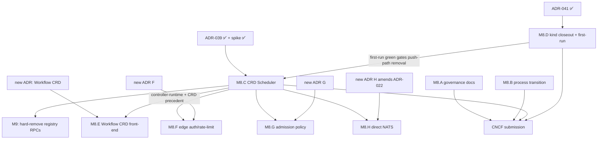

<!-- SPDX-License-Identifier: Apache-2.0 -->

# Zynax M8 — CNCF Sandbox Submission Planning

> **Target version:** v1.0.0 · **GitHub milestone:** #8 (`CNCF Sandbox (M8)`)
> **Status:** Staged (pre-open — M7 is still the active milestone; `state/milestone.yaml` rotates to
> M8 only at `/milestone close` M7 → `/milestone open` M8, per the milestone-lifecycle contract)
> · **Last updated:** 2026-07-03 · **Planning author:** SPDD program plan
> **Program context:** final milestone of the program M7 → M-UX → M-dx → M8 (see
> [ROADMAP.md](../../ROADMAP.md)); this doc stages M8's centerpiece early because its ADRs
> (ADR-039/040/041) landed in M7 and sequence the build here.

This document is the **single planning source of truth** for M8. Its centerpiece is the
**thin-Zynax Kubernetes-native reduction** — finishing the program that ADR-040 codified:
*Zynax builds only what is unique to it (the AI scheduling/intelligence layer) and delegates every
generic orchestration primitive to Kubernetes and the cloud-native ecosystem* — plus the CNCF
governance/readiness work that pre-exists on the milestone (M8.A/M8.B).

---

## 0 — TL;DR

M6 made the platform production-ready on K8s; M7 made workflows usable and observable. What remains
before a credible CNCF Sandbox submission is **erasing the last places where Zynax re-implements
Kubernetes**: a push-based agent registry that duplicates discovery/liveness/watch/cache (→ `Agent`
CRD + stateless informer-backed scheduler, ADR-039), the deprecated Compose runtime leftovers
(ADR-041 Phase 1 — kind-first docs, `make demo`, `zynax up` — already landed in M7; M8 closes it
out), and — behind fresh ADR gates — an imperative-only workflow surface (→ thin `Workflow` CRD
front-end, ADR-040 §3) and three bespoke edge/infra layers (gateway auth/rate-limit, compiler
policy gate, event-bus gRPC facade).

**M8 ships when:** an operator manages agents (and, if M8.E's ADR is accepted, workflows) as plain
Kubernetes resources; dispatch is readiness- and metrics-aware with a stated rationale; the Compose
runner is gone and first-run works on kind in one command; every remaining Zynax service justifies
itself under the ADR-040 test; and the governance artifacts (M8.A/M8.B) are submission-ready at
v1.0.0.

---

## 1 — What is already decided (the ADR cluster)

The K8s-native reduction is **not** new design work — it was decided and de-risked in M7:

| Decision | Artifact | Status |
|----------|----------|--------|
| Delegation boundary — "thin-Zynax": build only the AI scheduling/intelligence core; delegate every generic primitive; new infra **must** be a K8s primitive | [ADR-040](../adr/ADR-040-kubernetes-native-delegation-boundary.md) | Accepted (2026-06-22) |
| `Agent` CRD as single source of truth; agent-registry → stateless informer-backed **Scheduler**; `SelectAgent` RPC; push registration removed | [ADR-039](../adr/ADR-039-crd-native-scheduler.md) | Accepted (2026-06-22) — **spike verified** on kind (`spike/adr-039-crd-scheduler-proof`) |
| kind as the unified local/CI/prod runtime; Compose retired | [ADR-041](../adr/ADR-041-kind-native-unified-runtime.md) | Accepted (2026-06-25; amended 2026-07-01 with `zynax up/down`) — **Phase 1 delivered in M7** (kind-first docs, `make demo`, `zynax up`) |
| Workflow CRD = thin authoring front-end only; execution stays engine-agnostic IR; etcd never holds run state | ADR-040 §3 → [ADR-043](../adr/ADR-043-workflow-crd-front-end.md) (M8.E story 1) | ✅ Accepted (2026-07-03) |
| Edge/infra delegation beyond the ADR-040 list (gateway edge, admission policy, event-bus facade) | [ADR-044](../adr/ADR-044-gateway-api-edge-auth-ratelimit.md)/[ADR-045](../adr/ADR-045-admission-policy-delegation.md)/[ADR-046](../adr/ADR-046-direct-nats-jetstream.md) (M8.F/G/H story 1s) | ✅ All three Accepted (2026-07-03) |

Already delegated per the ADR-040 audit — **no M8 work needed**: metrics (Prometheus), tracing/logs
(OTel→Uptrace), auth transport (cert-manager mTLS + RBAC), config/secrets (ConfigMaps/Secrets+env),
service discovery (K8s DNS), scaling (HPA), networking (NetworkPolicy). Protected custom core —
**never delegated** (ADR-040 §6): capability matching + scheduling intelligence, task dispatch,
IR + pluggable engines (the portability wedge), llm routing, MCP integration, memory-service,
context-slice/expert isolation.

---

## 2 — EPIC Decomposition (M8)

Two governance EPICs pre-exist; six are added by this plan. Letters continue the existing
`M8.A`/`M8.B` scheme.

| EPIC | Title | Type | GitHub issue | Primary area | Gate |
|------|-------|------|--------------|--------------|------|
| **M8.A** | Governance & community readiness (MAINTAINERS, troubleshooting, first-issue) | docs | **#470** (pre-existing) | docs | — |
| **M8.B** | Post-M8 process transition: Fork A narrowing + CNCF submission | docs | **#471** (pre-existing) | docs | — |
| **M8.C** | **CRD-native Scheduler** — `Agent` CRD source of truth; registry → stateless scheduler | feat | **#1571** ✅ **DELIVERED** (PRs #1586, #1588–#1597; canvas Implemented; gate #1572 discharged) | agent-registry, task-broker, protos, infra | ADR-039 ✅ Accepted |
| **M8.D** | kind runtime closeout: first-run on the CRD path + Compose runtime removal (absorbs #1501) | feat/chore | **#1572** ✅ **DELIVERED** (PRs #1601–#1604; canvas Implemented) | infra, cli, ci, docs | ADR-041 ✅ Accepted |
| **M8.E** | Thin `Workflow` CRD front-end (GitOps authoring; zero run-state in etcd) | feat | **#1573** (new) | workflow-compiler, infra, cli | [ADR-043](../adr/ADR-043-workflow-crd-front-end.md) ✅ Accepted (story 1) |
| **M8.F** | Edge delegation: gateway auth + rate-limit → Gateway API / Envoy | feat | **#1574** (new) | api-gateway, infra | [ADR-044](../adr/ADR-044-gateway-api-edge-auth-ratelimit.md) ✅ Accepted (story 1; amends ADR-040) |
| **M8.G** | Admission policy: compiler routing/quota gate → Kyverno/OPA + quota | feat | **#1575** (new) | workflow-compiler, infra | [ADR-045](../adr/ADR-045-admission-policy-delegation.md) ✅ Accepted (story 1; amends ADR-040, depends on ADR-043) |
| **M8.H** | Event-bus facade retirement → direct NATS JetStream | feat/refactor | **#1576** (new) | event-bus, protos, agents/sdk | [ADR-046](../adr/ADR-046-direct-nats-jetstream.md) ✅ Accepted (story 1; amends ADR-022) |

> Pre-existing unassigned M8 backlog reviewed with this plan: **#1501** (Compose runner removal)
> becomes a child of M8.D. **#244** (Flux GitOps staging) and **#245** (Terraform bootstrap) stay
> standalone backlog — re-triage at formal M8 open. Story issues are created per-EPIC via `/plan`
> (§5); every `feat:` EPIC carries a REASONS Canvas (Aligned before code, ADR-019).

### M8.C — CRD-native Scheduler *(keystone of the reduction)*
The one genuinely Zynax-owned infrastructure duplication left (ADR-040 audit): a push registry
re-implementing lifecycle, health, watches, and caching the control plane already provides.
Replaced per ADR-039: `Agent` CRD (`zynax.io/v1alpha1`) + controller-runtime informer cache +
stateless `SelectAgent` scheduler (readiness from EndpointSlice; Prometheus at schedule time;
degradation to readiness-filtered round-robin). Push RPCs deprecated in M8 (→ `UNIMPLEMENTED`),
hard-removed M9. task-broker upgrades from blind round-robin to scored selection.
**DoD:** stale-liveness + resync-on-restart + Prometheus-down BDD green on kind; agent-registry
runs with no database; `buf breaking` green.

### M8.D — kind runtime closeout *(load-bearing companion)*
ADR-041 Phase 1 already landed in M7 (kind-first README/quickstart, `make demo`, `zynax up`).
What remains — and what discharges ADR-039's stated trade-off (removing Compose discovery) — is
the closeout: promote `zynax up` to the primary documented first-run entry, prove first-run green
**on the CRD discovery path** (joint e2e with M8.C), run CI kind-only on both engine legs, and
remove the deprecated Compose **runtime** leftovers (#1501: runtime compose files, `make
run-local`, `demo-compose`, the Compose CI profile — the Docker build-tools harness is explicitly
retained). **Ordering constraint: M8.C's push-path deprecation/removal stories may not merge
before M8.D's CRD-path first-run verification is green.**

### M8.E — thin `Workflow` CRD front-end *(ADR-gated)*
ADR-040 §3 sanctions exactly this shape: a CRD as declarative/GitOps **authoring surface** whose
controller calls the existing compile→submit path; the IR stays portable across Temporal/Argo;
etcd never holds run state. Story 1 is the ADR itself.

### M8.F / M8.G / M8.H — edge & infra delegation *(ADR-gated; may be Rejected)*
Pushes the reduction past ADR-040's current list, so each starts with an independent ADR arguing
the one-way door: **F** gateway bearer-auth + per-pod rate-limit → Gateway API/Envoy (global
limits; standard policy CRDs); **G** compiler `policy_gate.go` engine allow-list + namespace quota
→ admission policy + quota machinery (covering **both** quota gates — the compiler's
`policy_gate.go` and the engine-adapter's dispatch-time `QuotaChecker`; the compiler keeps
engine-*fit* intelligence — that is protected core); **H** `EventBusService` gRPC facade → direct
JetStream via a shared client lib (topics, CloudEvents envelope, DLQ conventions preserved by
moving into the client; amends ADR-022 and needs explicit exceptions to ADR-001/ADR-013, which
today forbid direct NATS access; all three callers migrate, including api-gateway's
Subscribe→REST bridge). A **Rejected** ADR closes its epic with the rationale on record — that is
a valid, useful outcome.

---

## 3 — Dependency graph & critical path



**Critical path:** M8.D CRD-path first-run verification → M8.C cutover → v1.0.0. M8.C's additive steps
(scheduler.proto, CRD, informer, scorer) have no dependency and can start as soon as the canvas is
Aligned — they are `buf breaking`-safe and do not touch the push path. M8.E/F/G/H are strictly
post-M8.C (controller-runtime precedent + lowest priority) and each can be dropped without
endangering the milestone.

---

## 4 — ADRs required by this plan

| ADR | For | Gate character |
|-----|-----|----------------|
| Workflow CRD front-end | M8.E | [ADR-043](../adr/ADR-043-workflow-crd-front-end.md) ✅ Accepted (2026-07-03) — mandated by ADR-040 §3 |
| Edge delegation: gateway auth + rate-limit → Gateway API/Envoy | M8.F | [ADR-044](../adr/ADR-044-gateway-api-edge-auth-ratelimit.md) ✅ Accepted (2026-07-03; amends ADR-040) |
| Admission-delegated routing/quota policy | M8.G | [ADR-045](../adr/ADR-045-admission-policy-delegation.md) ✅ Accepted (2026-07-03) |
| Direct-NATS eventing (amends ADR-022) | M8.H | [ADR-046](../adr/ADR-046-direct-nats-jetstream.md) ✅ Accepted (2026-07-03) |

Per the repo decision-making guide: all four are one-way doors → ADR before any canvas alignment.

---

## 5 — SPDD command runbook

Every `feat:` EPIC: canvas Aligned before code (ADR-019). Per EPIC:

```
/plan #<epic>            → analysis → story → canvas → security-review (PASS) → align + link
[human review: canvas Status: Aligned]
/deliver <issue|canvas>  → one Operations step per PR → CI → squash-merge → post-merge verify
```

Order: `/plan #1571` first (done with this doc's PR cluster), `/plan #1572` next; M8.E/F/G/H
begin with their ADR stories and only run `/plan` for implementation after the ADR is Accepted.
New gRPC boundary in M8.C → `/lib:spdd-api-test` for the `.feature` before implementation.

---

## 6 — Risk register

| Risk | Likelihood | Impact | Mitigation |
|------|-----------|--------|------------|
| Push-path removal lands before first-run retarget → broken quickstart | medium | high | Hard ordering gate in §3; joint M8.C×M8.D e2e scenario |
| `controller-runtime`/`client-go` weight or `GOWORK=off` friction in the real service tree | low | medium | Spike proved the build (7/7 on kind); fallback per ADR-039: standalone module like `cmd/zynax` |
| Prometheus soft-dependency on the dispatch hot path | low | medium | ADR-039 §3: TTL-cached reads; degradation to readiness-filtered round-robin is a tested scenario |
| Edge-delegation ADRs (F/G/H) rejected after planning effort | medium | low | Each ADR is independent and cheap; Rejected = recorded rationale, epic closed — by design |
| One-way door regret (push registration removal touches every adapter, gateway, Helm, BDD) | low | high | Deprecate-then-remove sequencing (M8 → M9); migration guide; BDD parity before removal |
| Scope creep: "delegate everything" busywork | medium | medium | ADR-040 rationale table is the test — protected custom core (§1) is out of bounds |
| M7 close slips, blocking formal M8 open | medium | low | This plan stages M8; additive M8.C steps are safe pre-open; milestone.yaml untouched until rotation |

---

## 7 — Exit criteria (v1.0.0 / submission-ready)

- [ ] `kubectl apply` of an `Agent` CR is the only registration path; scheduler is stateless,
      informer-backed, metrics-aware; stale-liveness/resync/degradation BDD green (M8.C).
- [ ] `agent-registry` chart has no database; registry push RPCs return `UNIMPLEMENTED` and are
      marked deprecated (removal booked for M9) (M8.C).
- [ ] First-run: clean machine with Docker + kind + kubectl + Helm (the ADR-041 floor) →
      `zynax up` → example workflow → result, twice, kind-only — also green on the CRD discovery
      path; Compose runtime removed, build-tools harness retained (M8.D, #1501).
- [ ] CI: e2e on kind for both Temporal and Argo legs; no Compose legs (M8.D).
- [ ] Workflow CRD ADR resolved; if Accepted, `Workflow` CRs GitOps-sync and reconcile through
      compile→submit with zero run-state in etcd (M8.E).
- [ ] Each edge-delegation ADR (F/G/H) resolved Accepted-and-implemented or Rejected-with-rationale;
      no epic left open-undecided (M8.F/G/H).
- [ ] Every remaining Zynax service passes the ADR-040 test ("would a K8s primitive do this?") —
      recorded in the pre-submission architecture review.
- [ ] Governance artifacts complete (MAINTAINERS, troubleshooting, ROADMAP repositioning)
      (M8.A/M8.B: #494 #495 #496).
- [ ] Signed v1.0.0 tag + release notes; CNCF Sandbox submission package assembled.

---

## 8 — Traceability

`ROADMAP → this plan (EPIC) → REASONS Canvas → ADR (one-way doors) → GitHub issue → PR → BDD/e2e →
release notes`. Canvas per feat: EPIC under `docs/spdd/<issue>-<slug>/canvas.md`; this doc's EPIC
table is reconciled to live GitHub state at every `/reconcile` truth-pass.
