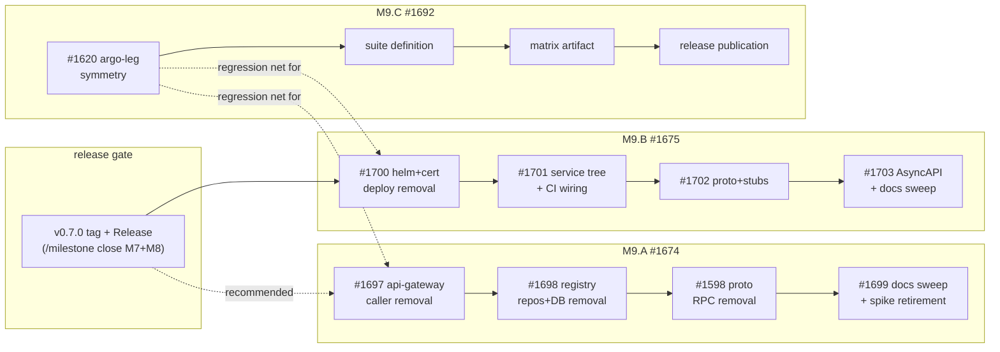

<!-- SPDX-License-Identifier: Apache-2.0 -->

# Zynax M9 — Hard Removals + Conformance Planning

> **Milestone:** M9 · GitHub milestone **#11** "Hard Removals + Conformance (M9)" · Target **v0.8.0**
> **Label:** `milestone: M9` · **Opened:** 2026-07-07
> **Predecessors:** M7 + M8 released together as **v0.7.0** (M7's v0.6.0 target was skipped to
> keep tags monotonic; one signed release closes both — see the ROADMAP version-plan footnote).
> v1.0.0 stays reserved for CNCF acceptance.
>
> ⚠️ Until the v0.7.0 close ritual completes (`/milestone close` for M7+M8 → tag + Release →
> `/milestone open M9`), `state/milestone.yaml` still shows M7 active. This plan is written
> against the GitHub truth so the rotation can consume it as-is.

## 0 — TL;DR

M9 deletes what M8 deprecated — per each ADR's own removal clause — and turns the
dual-engine e2e into a *named, published* conformance suite. Three epics, all scaffolded:

| EPIC | Issue | Governs | Canvas |
|------|-------|---------|--------|
| **M9.A** — agent-registry push-path hard-removal | [#1674](https://github.com/zynax-io/zynax/issues/1674) | ADR-039 removal clause | `docs/spdd/1674-agent-registry-push-removal/canvas.md` |
| **M9.B** — EventBusService facade hard-removal | [#1675](https://github.com/zynax-io/zynax/issues/1675) | ADR-046 Decision #6 | `docs/spdd/1675-event-bus-facade-removal/canvas.md` |
| **M9.C** — named engine-conformance suite | [#1692](https://github.com/zynax-io/zynax/issues/1692) | ROADMAP M9 exit criterion 3 (Fork A) | `docs/spdd/1692-engine-conformance-suite/canvas.md` |

EPIC table order = delivery priority. M9.C lands its symmetry fix early — the suite is the
regression net under the two removals.

## 1 — What is already decided

No new ADRs are required to execute M9. The decisions were taken in M8:

- **ADR-039** (Accepted 2026-06-22): push registration deprecated in M8.C
  (`UNIMPLEMENTED` since #1584), **hard removal scheduled for M9**. `AgentDef`/`CapabilityDef`
  messages stay (reused by `scheduler.proto`).
- **ADR-046** (Accepted 2026-07-03): facade deprecated in M8.H (#1673, merged 2026-07-07),
  **removed in M9 "once no caller references them"**. AsyncAPI channels remain the contract
  of record; `libs/zynaxevents` carries the conventions.
- **ADR-045 §3**: the compiler's `checkRoutingPolicy` REST dual-guard stays **past M9** —
  explicitly out of M9.B's blast radius.
- Open ADR *proposals* riding alongside (not M9 blockers): #1693 (ADR-048 API
  versioning/deprecation policy — would codify the removal convention M9 executes),
  #1694 (ADR-049 OIDC), #1695 (ADR-050 fuzz), #1696 (ADR-051 load/SLO).

## 2 — EPIC decomposition (M9)

### M9.A — agent-registry push-path hard-removal (#1674)

Order is load-bearing: caller → implementation → contract → docs.

| Step | Story | What |
|------|-------|------|
| 1 | [#1697](https://github.com/zynax-io/zynax/issues/1697) | api-gateway AgentDef push path + CLI surface deleted; documented retirement error |
| 2 | [#1698](https://github.com/zynax-io/zynax/issues/1698) | agent-registry push repos + Postgres dependency deleted; stateless resync verified live |
| 3 | [#1598](https://github.com/zynax-io/zynax/issues/1598) | deprecated `AgentRegistryService` RPCs removed from proto + stubs (documented `buf breaking` exception) |
| 4 | [#1699](https://github.com/zynax-io/zynax/issues/1699) | migration-guide sweep; status surfaces; retire `spike/adr-039-crd-scheduler-proof` |

### M9.B — EventBusService facade hard-removal (#1675)

Order: deploy → code → contract → spec. **Global gate: v0.7.0 published first** (the release
that ships the deprecation must exist before the removal lands).

| Step | Story | What |
|------|-------|------|
| 1 | [#1700](https://github.com/zynax-io/zynax/issues/1700) | chart + umbrella block + cert entry + `CN=zynax-event-bus` NATS identity + 50054 egress removed |
| 2 | [#1701](https://github.com/zynax-io/zynax/issues/1701) | `services/event-bus/` + release/build wiring deleted; zynaxevents goldens unchanged |
| 3 | [#1702](https://github.com/zynax-io/zynax/issues/1702) | `event_bus.proto` + stubs removed (zero-importer grep gate) |
| 4 | [#1703](https://github.com/zynax-io/zynax/issues/1703) | AsyncAPI deprecated access path dropped; eventing docs truth pass; epic closes |

### M9.C — named engine-conformance suite (#1692)

Formalise, don't rebuild: the existing e2e matrix is the runner. Step 1 is filed; steps 2–4
stories are created via `/lib:spdd-story` when the canvas is aligned (the suite name and
versioning scheme are the open design decisions a human settles at alignment).

| Step | Story | What |
|------|-------|------|
| 1 | [#1620](https://github.com/zynax-io/zynax/issues/1620) | Workflow CRD reconcile e2e assertion extended to the argo leg (leg symmetry) |
| 2 | *(on alignment)* | suite definition: name, version scheme, scenario membership, pass criteria |
| 3 | *(on alignment)* | machine-readable per-engine matrix artifact + one-command local run |
| 4 | *(on alignment)* | per-release publication + adapter-author how-to |

## 3 — Dependency graph & critical path

- **Critical path:** v0.7.0 close ritual → M9.B chain (4 sequential PRs) — the longest strictly
  ordered chain with an external gate.
- **Parallel groups:** M9.A ∥ M9.B ∥ M9.C are mutually independent; within each epic the steps
  are strictly sequential. #1620 (M9.C step 1) has no gate at all and can merge **first**.
- Cross-epic note: nothing in M9.A/M9.B may weaken the e2e both-legs gate — M9.C exists to
  make exactly that gate publishable.

## 4 — Prerequisites owned outside M9 (human runbook)

1. Merge/close the M8 tail: #1650 + #1576 are delivered (PR #1673 merged) but open; M8.I
   (#1680–#1685, merge queue) is M8's remaining active epic.
2. `/milestone close` — signed **v0.7.0** tag + GitHub Release; closes GitHub milestones #7
   and #8; rotates `state/milestone.yaml` (M7+M8 → history).
3. `/milestone open M9` — activates M9 in `state/milestone.yaml` (this planning doc is
   already in place for it).
4. Align the three canvases (`Status: Draft → Aligned`) after review; flip the M9 stories
   `status: backlog → status: ready`; then `/deliver`.

## 5 — Risk register

| Risk | P | I | Mitigation |
|------|---|---|-----------|
| Removal lands before v0.7.0 exists → deprecation and removal ship in the same release | M | H | v0.7.0-published gate encoded in the M9.B canvas Norms + story bodies; step 1 `Depends on #1650` keeps the chain blocked until the M8 tail closes |
| Hidden caller of removed surfaces (adapter or SDK reference missed) | L | H | zero-reference grep gates in #1697/#1702 acceptance criteria; e2e both legs after every step |
| `buf breaking` exception scoped too widely | L | M | exception limited to the named file/RPCs per story AC; PROTO REVIEWED label on the proto PRs |
| Suite naming bikeshed stalls M9.C | M | L | only step 2+ blocks on the decision; #1620 merges independently; alignment settles the name |
| Milestone-number skew (M9 = GitHub #11) breaks tooling assumptions | M | M | all tooling reads `state/milestone.yaml` `github_milestone_number` — never `M<n>` ↔ `#n`; this doc records the mapping |
| `checkRoutingPolicy` swept accidentally in M9.B | L | H | explicit canvas safeguard + epic-body warning (ADR-045 §3) |

## 6 — Exit criteria (v0.8.0)

- [ ] ROADMAP M9 checklist: push path removed (ADR-039) · facade removed (ADR-046) · named
      conformance suite over the dual-engine e2e.
- [ ] All three epics closed; canvases at `Status: Implemented`.
- [ ] Repo-wide: no non-historical references to `RegisterAgent` push flow or
      `EventBusService`; `make validate-spec` green; `kubectl get deploy -n zynax` shows the
      reduced service set.
- [ ] A release-published conformance matrix exists for v0.8.0 itself (the suite's first
      official artifact).
- [ ] `/milestone close M9` preconditions met (no open `type: epic` in GitHub milestone #11).

## 7 — Traceability

- ROADMAP: [ROADMAP.md §Milestone 9](../../ROADMAP.md) · Positioning: [docs/product/positioning.md](../product/positioning.md)
- ADRs: [ADR-039](../adr/ADR-039-crd-native-scheduler.md) · [ADR-046](../adr/ADR-046-direct-nats-jetstream.md) · [ADR-045 §3](../adr/ADR-045-admission-policy-delegation.md)
- Canvases: [1674](../spdd/1674-agent-registry-push-removal/canvas.md) · [1675](../spdd/1675-event-bus-facade-removal/canvas.md) · [1692](../spdd/1692-engine-conformance-suite/canvas.md)
- Predecessor deliveries: M8.C (#1571, PRs #1585–#1599) · M8.H (#1576, PRs #1651–#1667, #1673)
