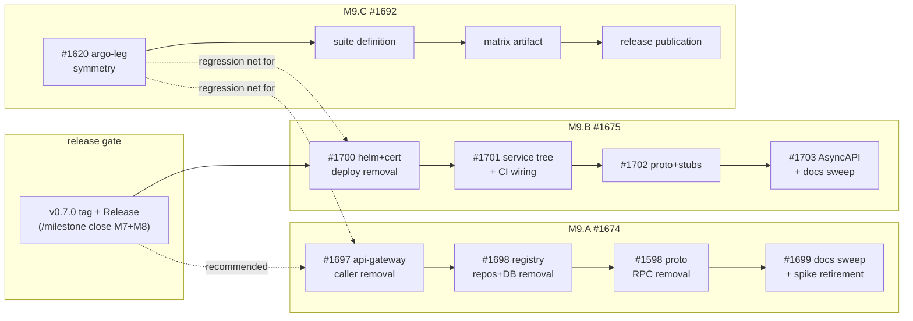

<!-- SPDX-License-Identifier: Apache-2.0 -->

# Zynax M9 — Hard Removals + Conformance Planning

> **Milestone:** M9 · GitHub milestone **#11** "Hard Removals + Conformance (M9)" · Target **v0.8.0**
> **Label:** `milestone: M9` · **Opened:** 2026-07-07
> **Predecessors:** M7 + M8 released together as **v0.7.0** (M7's v0.6.0 target was skipped to
> keep tags monotonic; one signed release closes both — see the ROADMAP version-plan footnote).
> v1.0.0 stays reserved for CNCF acceptance.
>
> ✅ The v0.7.0 close ritual completed 2026-07-10: signed tag + GitHub Release published,
> milestones #7/#8 closed, `state/milestone.yaml` rotated to M9 active (#1733). The M9.A/M9.B
> gate (deprecation release published before any removal merges) is satisfied.

## 0 — TL;DR

M9 deletes what M8 deprecated — per each ADR's own removal clause — and turns the
dual-engine e2e into a *named, published* conformance suite. Three epics, all scaffolded:

| EPIC | Issue | Governs | Canvas |
|------|-------|---------|--------|
| **M9.A** — agent-registry push-path hard-removal | [#1674](https://github.com/zynax-io/zynax/issues/1674) | ADR-039 removal clause | `docs/spdd/1674-agent-registry-push-removal/canvas.md` |
| **M9.B** — EventBusService facade hard-removal ✅ **complete** (2026-08-04) | [#1675](https://github.com/zynax-io/zynax/issues/1675) | ADR-046 Decision #6 | `docs/spdd/1675-event-bus-facade-removal/canvas.md` |
| **M9.C** — named engine-conformance suite | [#1692](https://github.com/zynax-io/zynax/issues/1692) | ROADMAP M9 exit criterion 3 (Fork A) | `docs/spdd/1692-engine-conformance-suite/canvas.md` |

EPIC table order = delivery priority. M9.C lands its symmetry fix early — the suite is the
regression net under the two removals.

## 1 — What is already decided

No new ADRs are required to execute M9. The decisions were taken in M8:

- **ADR-039** (Accepted 2026-06-22): push registration deprecated in M8.C
  (`UNIMPLEMENTED` since #1584), **hard removal scheduled for M9**. `AgentDef`/`CapabilityDef`
  messages stay (reused by `scheduler.proto`).
- **ADR-046** (Accepted 2026-07-03): facade deprecated in M8.H (#1673, merged 2026-07-07),
  **removed in M9 "once no caller references them"**. AsyncAPI channels remain the contract
  of record; `libs/zynaxevents` carries the conventions.
- **ADR-045 §3**: the compiler's `checkRoutingPolicy` REST dual-guard stays **past M9** —
  explicitly out of M9.B's blast radius.
- Open ADR *proposals* riding alongside (not M9 blockers): #1693 (ADR-048 API
  versioning/deprecation policy — would codify the removal convention M9 executes),
  #1694 (ADR-049 OIDC), #1695 (ADR-050 fuzz), #1696 (ADR-051 load/SLO).

## 2 — EPIC decomposition (M9)

### M9.A — agent-registry push-path hard-removal (#1674)

Order is load-bearing: caller → implementation → contract → docs.

| Step | Story | What |
|------|-------|------|
| 1 ✅ | [#1697](https://github.com/zynax-io/zynax/issues/1697) | api-gateway AgentDef push path + CLI surface deleted; documented retirement error |
| 2 ✅ | [#1698](https://github.com/zynax-io/zynax/issues/1698) | agent-registry push repos + Postgres dependency deleted; stateless resync verified live — landed as 3 PRs (#1751 → #1752 → #1754), see the size note below |
| 3 ✅ | [#1598](https://github.com/zynax-io/zynax/issues/1598) | deprecated `AgentRegistryService` RPCs removed from proto + stubs; file-scoped `buf breaking` exception per ADR-048 §Decision 4 — landed as 7 disjoint slices (#1757, #1758, #1759, #1760, #1762, #1763 → #1764), see the size note below |
| 4 ✅ | [#1699](https://github.com/zynax-io/zynax/issues/1699) | migration-guide sweep; status surfaces; retired adapter config keys (`registry_endpoint` / `REGISTRY_ADDR`) and the `agent publish` CLI alias; `spike/adr-039-crd-scheduler-proof` deleted — **epic #1674 closed** |

> **Step 4 was not docs-only.** #1598 deferred two deploy-affecting items to it: the dead
> required `registry_endpoint` (5 Go adapters) / `REGISTRY_ADDR` (langgraph) config keys, and
> the `zynax agent publish` CLI alias. Both shipped here, so the step landed as `chore:` rather
> than the `docs:` the canvas anticipated. Removal is safe **one way only**: a new image with
> the key still set boots (Go `yaml.Unmarshal` is non-strict; pydantic-settings is
> `extra="ignore"`), but an old image with the key *deleted* fails startup validation. CI
> demonstrated it — dropping `REGISTRY_ADDR` from the e2e echo-worker manifest timed out both
> legs, because that Deployment pins `langgraph-adapter:main`, an image the PR does not
> rebuild. Deployed manifests therefore keep the keys until the rebuilt `:main` images ship. The sweep also surfaced two pre-existing
> AgentDef-POST breakages left for a follow-up — see §5.

> **Sizing note for the remaining removal steps.** Step 2 measured 1846 counted lines and
> could not clear the required 900-line `PR size label` gate as one PR; it shipped as three
> disjoint slices merged in compile order. #1363 has since added a `split-not-possible`
> label that downgrades the hard failure for *irreducible* PRs — but prefer splitting when
> the layers are compile-independent (as here: handler shim → repo adapters → domain
> package), and reserve the label for removals that genuinely cannot be cut, such as
> #1701's `services/event-bus/` deletion. Size #1598 and M9.B's steps accordingly, up
> front, instead of discovering the gate mid-delivery.
>
> Step 3 measured **5115** counted lines — 5.7× the hard limit — and shipped as **seven**
> disjoint slices merged caller → spec → contract: specs (#1757, #1758), then the five
> adapters and the gateway route (#1759, #1760, #1762, #1763), then the proto + regenerated
> stubs (#1764). No `split-not-possible` label was needed: every layer was
> compile-independent, so slices 1–6 merged in parallel and only the contract slice had to
> wait. The binding constraint on how finely to cut was the 900-line cap per slice, not the
> dependency graph — bin-pack the measured per-directory totals before opening anything.

### M9.B — EventBusService facade hard-removal (#1675)

Order: deploy → code → contract → spec. **Global gate: v0.7.0 published first** (the release
that ships the deprecation must exist before the removal lands).

| Step | Story | What |
|------|-------|------|
| 1 ✅ | [#1700](https://github.com/zynax-io/zynax/issues/1700) | chart + umbrella block + cert entry + `CN=zynax-event-bus` NATS identity + 50054 egress removed |
| 2 ✅ | [#1701](https://github.com/zynax-io/zynax/issues/1701) | `services/event-bus/` + release/build wiring deleted; zynaxevents goldens unchanged; protos/tests `EventBusService` BDD suite retired with a pointer to the `libs/zynaxevents` suites |
| 3 ✅ | [#1702](https://github.com/zynax-io/zynax/issues/1702) | `event_bus.proto` + stubs removed (zero-importer grep gate); file-scoped `buf breaking` exception in `protos/buf.yaml` |
| 4 ✅ | [#1703](https://github.com/zynax-io/zynax/issues/1703) | AsyncAPI deprecated access path dropped (channels byte-identical); eventing docs truth pass across spec, patterns, ARCHITECTURE, README and `services/task-broker/AGENTS.md`; historical records preserved; **EPIC #1675 closed** |

### M9.C — named engine-conformance suite (#1692)

Formalise, don't rebuild: the existing e2e matrix is the runner. Step 1 is filed; steps 2–4
stories are created via `/lib:spdd-story` when the canvas is aligned (the suite name and
versioning scheme are the open design decisions a human settles at alignment).

| Step | Story | What |
|------|-------|------|
| 1 ✅ | [#1620](https://github.com/zynax-io/zynax/issues/1620) | Workflow CRD reconcile e2e assertion extended to the argo leg (leg symmetry) — **done**: argo dispatch was never broken; the assertion's `kubectl get workflow` short name resolved to the Argo CRD (`workflows.argoproj.io`) on that leg. Script now pins `workflow.zynax.io`; guard dropped; verified on a live argo kind cluster |
| 2 ✅ | [#1773](https://github.com/zynax-io/zynax/issues/1773) | **ZECS v0.8.0** defined in `docs/conformance/` — scenarios, legs, pass criteria transcribed from what `scripts/e2e/*.sh` actually assert (gaps G1–G6 recorded, not papered over), `scenarios.yaml` membership over `spec/workflows/examples/`, and the `zynax-ci check conformance` drift guard (membership ↔ corpus ↔ selectable engines ↔ e2e matrix legs). No second harness; PR cadence unchanged |
| 3 | [#1774](https://github.com/zynax-io/zynax/issues/1774) | machine-readable per-engine matrix artifact + one-command local run |
| 4 | [#1775](https://github.com/zynax-io/zynax/issues/1775) | per-release publication + adapter-author how-to |

## 3 — Dependency graph & critical path

```mermaid
graph LR
  subgraph gate["release gate"]
    V["v0.7.0 tag + Release<br/>(/milestone close M7+M8)"]
  end
  subgraph M9A["M9.A #1674"]
    A1["#1697 api-gateway<br/>caller removal"] --> A2["#1698 registry<br/>repos+DB removal"]
    A2 --> A3["#1598 proto<br/>RPC removal"] --> A4["#1699 docs sweep<br/>+ spike retirement"]
  end
  subgraph M9B["M9.B #1675"]
    B1["#1700 helm+cert<br/>deploy removal"] --> B2["#1701 service tree<br/>+ CI wiring"]
    B2 --> B3["#1702 proto+stubs"] --> B4["#1703 AsyncAPI<br/>+ docs sweep"]
  end
  subgraph M9C["M9.C #1692"]
    C1["#1620 argo-leg<br/>symmetry"] --> C2["suite definition"]
    C2 --> C3["matrix artifact"] --> C4["release publication"]
  end
  V --> B1
  V -.recommended.-> A1
  C1 -.regression net for.-> A1
  C1 -.regression net for.-> B1
```

- **Critical path:** the M9.B chain (4 sequential PRs) — the longest strictly ordered chain;
  its external gate (v0.7.0 published) was satisfied 2026-07-10.
- **Parallel groups:** M9.A ∥ M9.B ∥ M9.C are mutually independent; within each epic the steps
  are strictly sequential. #1620 (M9.C step 1) has no gate at all and can merge **first**.
- Cross-epic note: nothing in M9.A/M9.B may weaken the e2e both-legs gate — M9.C exists to
  make exactly that gate publishable.

## 4 — Prerequisites owned outside M9 (human runbook)

1. ✅ M8 tail resolved (2026-07-10): #1650 closed (delivered by PR #1673), #1576 closed;
   M8.I epic #1680 carried into milestone M9 and closed with fork-canary evidence (#1685).
2. ✅ `/milestone close` done 2026-07-10 — signed **v0.7.0** tag + GitHub Release; milestones
   #7 and #8 closed; `state/milestone.yaml` rotated (M7+M8 → history) in #1733.
3. ✅ `/milestone open M9` done 2026-07-10 — M9 active in `state/milestone.yaml` (#1733).
4. ✅ The three canvases aligned (`Status: Draft → Aligned`, PR #1734, 2026-07-10); the nine
   M9 stories flipped to `status: ready`; `/deliver` is unblocked.

## 5 — Risk register

| Risk | P | I | Mitigation |
|------|---|---|-----------|
| Removal lands before v0.7.0 exists → deprecation and removal ship in the same release | M | H | v0.7.0-published gate encoded in the M9.B canvas Norms + story bodies; step 1 `Depends on #1650` keeps the chain blocked until the M8 tail closes |
| Hidden caller of removed surfaces (adapter or SDK reference missed) | L | H | zero-reference grep gates in #1697/#1702 acceptance criteria; e2e both legs after every step |
| `buf breaking` exception scoped too widely | L | M | exception limited to the named file/RPCs per story AC; PROTO REVIEWED label on the proto PRs |
| Suite naming bikeshed stalls M9.C | M | L | only step 2+ blocks on the decision; #1620 merges independently; alignment settles the name |
| Milestone-number skew (M9 = GitHub #11) breaks tooling assumptions | M | M | all tooling reads `state/milestone.yaml` `github_milestone_number` — never `M<n>` ↔ `#n`; this doc records the mapping |
| `checkRoutingPolicy` swept accidentally in M9.B | L | H | explicit canvas safeguard + epic-body warning (ADR-045 §3) |

> **Materialised (2026-08-04, found by the #1699 sweep — not fixed there).** The "hidden
> caller" risk landed one row lower than the grep gates looked: two callers still **POST
> `kind: AgentDef` to `/api/v1/apply`**, which has answered `400 UNSUPPORTED_KIND` since
> #1598 removed the kind from the gateway allowlist. Both were confirmed at runtime against a
> locally booted api-gateway, both pre-date #1699, and both need a design call plus live-cluster
> verification, so they are a follow-up rather than a sweep edit:
>
> 1. `zynax apply <scenario-dir>` — a Scenario's `apply_order` submits its AgentDef members
>    first, so the whole scenario aborts on member 1
>    (`spec/scenarios/code-review/`, `cmd/zynax/cmd/apply.go` → `runApplyScenario`).
> 2. `infra/packages/code-review-rank/apply-job.yaml` — POSTs `agentdef.yaml` before the
>    Workflow. The response is unchecked so the Job still completes, but the package ships no
>    `Agent` CR, so the scheduler has nothing to select.
>
> Both reduce to the same question the CRD cutover left open: **what replaces an AgentDef
> member in a Scenario / package now that identity is a CR?** Answer it once, then fix both.

## 6 — Exit criteria (v0.8.0)

- [ ] ROADMAP M9 checklist: push path removed (ADR-039 ✅ #1674) · facade removed (ADR-046 ✅
      #1675) · named conformance suite over the dual-engine e2e.
- [ ] All three epics closed; canvases at `Status: Implemented`.
- [ ] Repo-wide: no non-historical references to `RegisterAgent` push flow or
      `EventBusService`; `make validate-spec` green; `kubectl get deploy -n zynax` shows the
      reduced service set.
- [ ] A release-published conformance matrix exists for v0.8.0 itself (the suite's first
      official artifact).
- [ ] `/milestone close M9` preconditions met (no open `type: epic` in GitHub milestone #11).

## 7 — Traceability

- ROADMAP: [ROADMAP.md §Milestone 9](../../ROADMAP.md) · Positioning: [docs/product/positioning.md](../product/positioning.md)
- ADRs: [ADR-039](../adr/ADR-039-crd-native-scheduler.md) · [ADR-046](../adr/ADR-046-direct-nats-jetstream.md) · [ADR-045 §3](../adr/ADR-045-admission-policy-delegation.md)
- Canvases: [1674](../spdd/1674-agent-registry-push-removal/canvas.md) · [1675](../spdd/1675-event-bus-facade-removal/canvas.md) · [1692](../spdd/1692-engine-conformance-suite/canvas.md)
- Predecessor deliveries: M8.C (#1571, PRs #1585–#1599) · M8.H (#1576, PRs #1651–#1667, #1673)
